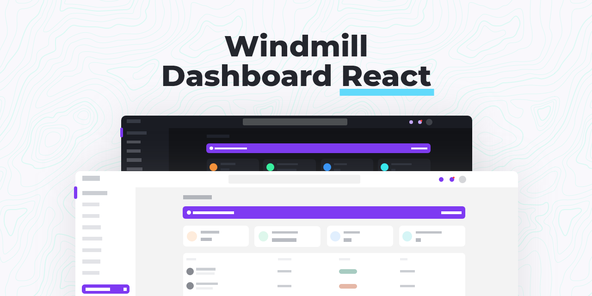

<p align="center">
    <a href="https://windmill-dashboard-nextjs.vercel.app/app">
      
    </a><br>
    Four 100 scores and PWA ready. Just connect your data.
</p>

🚀 [See it live](https://windmill-dashboard-nextjs.vercel.app/app)

This is not a template. This is a complete application, built on top of React, with all tiny details taken care of so you just need to bring the data to feed it.

Accessibility is a priority in my projects and I think it should be in yours too, so this was developed listening to real screen readers, focus traps and keyboard navigation are available everywhere.

## 📦 Features

- 🦮 Throughly accessible (developed using screen readers)
- 🌗 Dark theme enabled (load even different images based on theme)
- 🧩 Multiple (custom) components
- ⚡ Code splitting
- Tailwind CSS
- [Windmill React UI](https://windmillui.com/react-ui)
- Heroicons
- Chart.js
- PWA delivering offline-first and app-like experience

## 📚 Docs

### General components

Windmill Dashboard React is built on top of [Windmill React UI](https://windmillui.com/react-ui). You will find the documentation for every small component there.

### Routing

Routes in Windmill Dashboard are separated into two categories, sidebar ([routes/sidebar.js](src/routes/sidebar.js)) and general ([pages](pages)).

#### Sidebar routes

These are the routes that will show in the sidebar. They expect three properties:

- `path`: the destination;
- `name`: the name to be shown;
- `icon`: an icon to illustrate the item

Item that are used as dropdowns, like the Pages option, don't need a `path`, but expect a `routes` array of objects with `path` and `name`:

```js
// sidebar.js
{
  path: '/app/tables',
  icon: 'TablesIcon',
  name: 'Tables',
},
{
  icon: 'PagesIcon', // <-- this is used as a submenu, so no path
  name: 'Pages',
  routes: [
    // submenu
    {
      path: '/login',
      name: 'Login', // <-- these don't have icons
    },
    {
      path: '/create-account',
      name: 'Create account',
    },
```

#### General (Router) routes

These are **internal** (private) routes. They will be rendered inside the app, using the default `containers/Layout`.

If you want to add a route to, let's say, a landing page, you should add it to the `App`'s router ([src/App.js](src/App.js), exactly like `Login`, `CreateAccount` and other pages are routed.

#### How to add a new page to router?

1. Create your page inside `src/pages`, say `MyPage.js`;
2. Add it to the global router (`pages/index.js`)

Then add it to the pages folder

3. If you want to make this page accessible from the sidebar, you have two options:

- add it to the root `routes` array

```js
{
  path: '/app/my-page', // /app + the url you added in routes/index.js
  icon: 'HomeIcon', // the component being exported from src/icons/index.js
  name: 'My Page', // name that appear in Sidebar
},
```

- add it as an option under a dropdown

```js
{
  icon: 'PagesIcon',
  name: 'Pages',
  routes: [
    // submenu
    {
      path: '/app/my-page',
      name: 'My Page',
    },
```

If you're asking where does this `/app` come from, it is from this line inside `pages/_app.js` and `pages/_document.js`, that renders the app

---

This project was bootstrapped with [Create React App](https://github.com/facebook/create-react-app).

## Available Scripts

In the project directory, you can run:

### `npm start`

Runs the app in the development mode.<br />
Open [http://localhost:3000](http://localhost:3000) to view it in the browser.

The page will reload if you make edits.<br />
You will also see any lint errors in the console.

### `npm test`

Launches the test runner in the interactive watch mode.<br />
See the section about [running tests](https://facebook.github.io/create-react-app/docs/running-tests) for more information.

### `npm run build`

Builds the app for production to the `build` folder.<br />
It correctly bundles React in production mode and optimizes the build for the best performance.

The build is minified and the filenames include the hashes.<br />
Your app is ready to be deployed!

See the section about [deployment](https://facebook.github.io/create-react-app/docs/deployment) for more information.

### `npm run eject`

**Note: this is a one-way operation. Once you `eject`, you can’t go back!**

If you aren’t satisfied with the build tool and configuration choices, you can `eject` at any time. This command will remove the single build dependency from your project.

Instead, it will copy all the configuration files and the transitive dependencies (webpack, Babel, ESLint, etc) right into your project so you have full control over them. All of the commands except `eject` will still work, but they will point to the copied scripts so you can tweak them. At this point you’re on your own.

You don’t have to ever use `eject`. The curated feature set is suitable for small and middle deployments, and you shouldn’t feel obligated to use this feature. However we understand that this tool wouldn’t be useful if you couldn’t customize it when you are ready for it.

## Learn More

You can learn more in the [Create React App documentation](https://facebook.github.io/create-react-app/docs/getting-started).

To learn React, check out the [React documentation](https://reactjs.org/).

### Code Splitting

This section has moved here: https://facebook.github.io/create-react-app/docs/code-splitting

### Analyzing the Bundle Size

This section has moved here: https://facebook.github.io/create-react-app/docs/analyzing-the-bundle-size

### Making a Progressive Web App

This section has moved here: https://facebook.github.io/create-react-app/docs/making-a-progressive-web-app

### Advanced Configuration

This section has moved here: https://facebook.github.io/create-react-app/docs/advanced-configuration

### Deployment

This section has moved here: https://facebook.github.io/create-react-app/docs/deployment

### `npm run build` fails to minify

This section has moved here: https://facebook.github.io/create-react-app/docs/troubleshooting#npm-run-build-fails-to-minify

---

windmill dashboard for nextjs, created by Aldhanekaa
I recommend you to use this template with chakra-ui, because some components look different than the react template.
